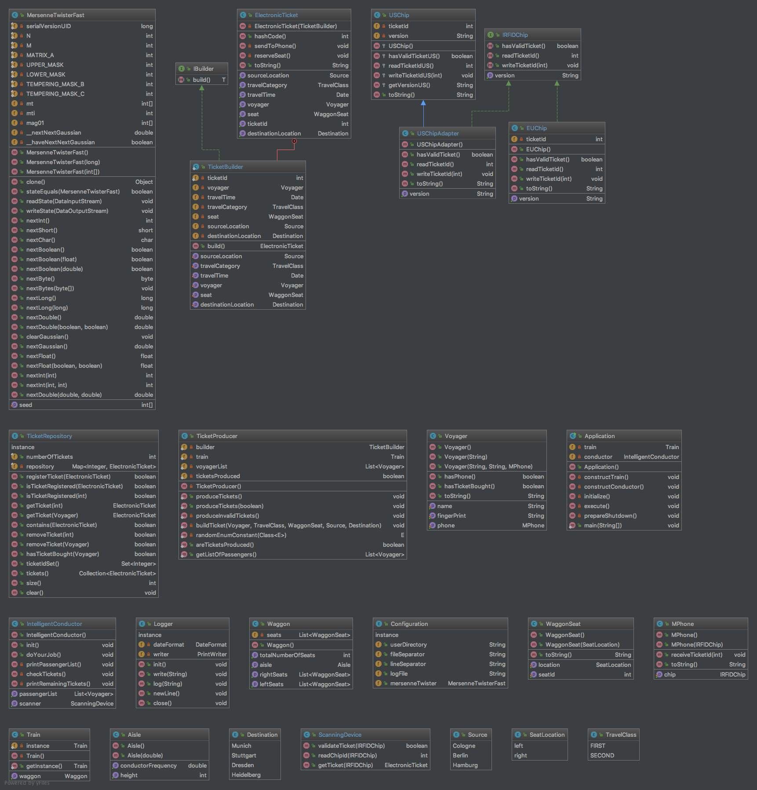

# Design Patterns Team (DPT) - Intelligent Conductor

**Used Design Patterns:** Builder, Bridge, Adapter

## Assignment of task T03
Ein Zug hat einen Waggon. Dieser Waggon hat auf der linken und rechten Seite je 25 Sitzplätze –
getrennt durch einen Gang. Das elektronische Ticket besteht aus den Informationen Reisender
(name und fingerPrint), Datum, Klasse sowie Strecke von und nach. Ein Builder erstellt das Ticket
und registriert es in einem zentralen Repository. Zusätzlich wird das Ticket dem Reisenden auf das
MPhone gesandt. Das MPhone ist mit einem RFID-Chip ausgestattet. Der RFID-Chip existiert in den
Varianten EU und US. Der intelligente Zugbegleiter besucht sukzessive die belegten Sitzplätze und
überprüft die Tickets anhand der registrierten Tickets im zentralen Repository. Standardmäßig
liest der intelligente Zugbegleiter den RFID-Chip der Variante EU. Für das Auslesen des RFID-Chips
der Variante US nutzt der intelligente Zugbegleiter einen Adapter.

## Wichtige Zielsetzungen
a) Wiederholung und Vertiefung des Wissens zu Design Patterns.
b) Praktische Anwendung der Design Patterns auf komplexe Aufgabenstellungen.
c) Optimale Klausurvorbereitung im Hinblick auf eine vorzugsweise sehr gute Bewertung.

## UML Class Diagram

## Wichtige Hinweise
− Pro Team werden zwei Aufgaben bearbeitet.
− Die Zuordnung der zwei Aufgaben zu einem Team erfolgt mit einem Zufallsgenerator.
− Bearbeitung der Aufgaben lokal auf den Rechnern und Nutzung der Templates.
− Studium der Struktur und Funktionsweise der beteiligten Design Patterns.
− Verwendung geeigneter englischer Begriffe für Namen und Bezeichnungen.
− Modellierung von zwei Klassendiagrammen in Enterprise Architect. Bitte
   * nutzen Sie das Theme „DHBW“ (Visual Style → Visual Appearance → Diagram).
   * legen Sie für jede Aufgabe ein separates Klassendiagramm an.
   * benennen Sie das Klassendiagramm mit task<id>, z.B. task50.
   * benennen Sie die Datei mit <team_id>_<task_id>.eap, z.B. 03_50.eap.
   * exportieren Sie das Klassendiagramm als PDF-Datei mit einer A4-Seite im Querformat.
− Implementierung einer einwandfrei lauffähigen Applikation in Java 8. Bitte
   * erstellen Sie ein Paket mit der Bezeichnung taskgroup<team_id>, z.B. taskgroup03.
   * erstellen Sie für jeden Task ein Unterpaket mit der Bezeichnung task<id>, z.B. task50.
   * nutzen Sie die camelCase-Notation, um die Lesbarkeit zu vereinfachen.
− Test der Implementierung mit JUnit und Gewährleistung der Funktionsweise.
− Modellierung und Implementierung wird mit je 5 Punkten pro Aufgabe bewertet.
− Erstellung einer vollständigen und verschlüsselten 7-Zip-Datei unter Beachtungdes Prozedere für die Abgabe von Prüfungsleistungen und der Namenskonvention.
− Zeitansatz: 10 Stunden
− Abgabetermin: Sonntag, 18.02.2018
− Bewertung: Testat, 20 Punkte
